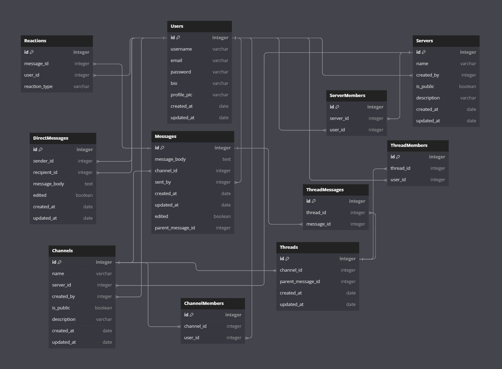

# Slack Clone Readme

## DB Schema

## User Story:
As a team member, I want to easily communicate and collaborate with my colleagues, so we can efficiently work together and stay organized on projects.
### User Story Description:
Title: Seamless Collaboration and Communication
As a team member of the newly introduced Slack clone platform, I want to experience a user-friendly and efficient communication and collaboration tool. This will enable me to effortlessly connect with my colleagues, enhance our productivity, and keep all project-related discussions and files organized in one place.
### Acceptance Criteria:
1. As a user, I can create an account with a unique username and password to access the platform securely.
2. As a user, I can easily join or create different servers and channels, allowing me to participate in relevant discussions with the right groups of people.
3. As a user, I can send and receive direct messages to my colleagues privately, ensuring smooth one-on-one communication.
4. As a user, I can send and receive messages, keeping me informed of important updates and discussions.
5. As a user, I can react to messages with emojis and use threaded conversations to keep discussions organized and coherent.
6. As a user, I can easily search for past messages and discussions, enabling me to retrieve important information quickly.
### Additional Considerations:
The platform should have a clean and intuitive user interface for an enjoyable user experience.
Security measures should be implemented to safeguard user data and privacy.
The platform should be scalable to accommodate a growing number of users and data.
By fulfilling these user stories and acceptance criteria, the Slack clone will create a robust and seamless collaboration and communication tool, empowering team members to work efficiently and effectively together.
