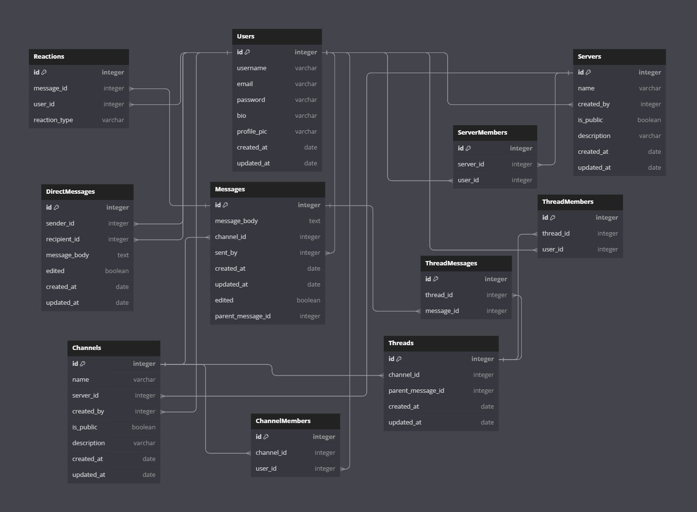

# WELCOME TO SLACKER!

This site was created by:
- Alex Breathwit
- Emily Morgan
- James Cao
- Ryan Erickson

## Check out our profiles:

#### Check out Alex:
- GitHub: https://github.com/BadaBingBadaBo0m
- Linkedin: https://www.linkedin.com/in/alex-breathwit-70a011272/

#### Check out Emily:
- GitHub: https://github.com/mocemmy
- Linkedin: https://www.linkedin.com/in/emily-morgan-7761b1155

#### Check out James:
- GitHub: https://github.com/jameslovescoding
- Linkedin: https://www.linkedin.com/in/james-cao-15a0b477/

#### Check out Ryan:
- GitHub: https://github.com/RyanFullStack
- Linkedin: https://www.linkedin.com/in/ryan-erickson-dev/

#### Database Schema:

#### Feature List:
##### Users
* Users should be able to create a profile
* Users should be able to edit their profile
* Users should be able to update their peofile
* Users should be able to delete their account
##### Servers
* Users should be able to view all publicly created servers.
* Users should be able to create new servers.
* Users should be able to update servers they created.
* Users should be able to delete servers they created.
##### Channels
* Users should be able to view all public channels in a server.
* Users should be able to create new channels in a server they own.
* Users should be able to update channels they created.
* Users should be able to delete channels they created.
##### Messages
* Users should be able to view all messages in a channel.
* Users should be able to create new messages.
* Users should be able to update messages they sent.
* Users should be able to delete messages they sent.
